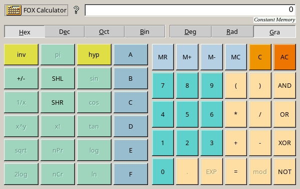
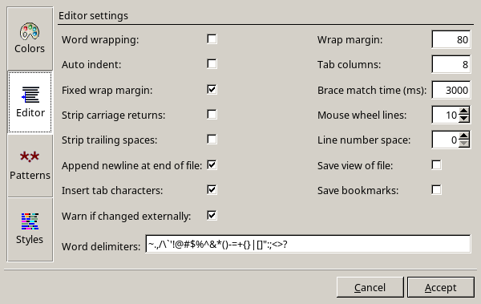
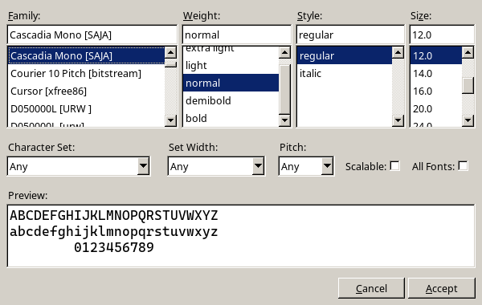
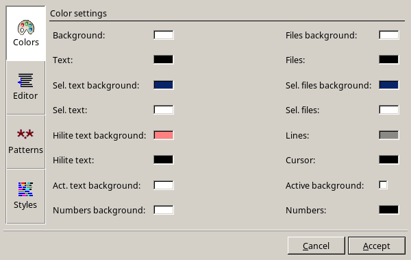
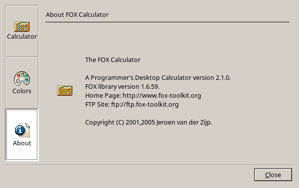

# FoxTK-rs

Rust bindings for the [fox-toolkit](http://www.fox-toolkit.org).

## What is [FOX](http://www.fox-toolkit.org)?

FOX is a C++ based Toolkit for developing Graphical User Interfaces easily and effectively. It offers a wide, and growing, collection of Controls, and provides state of the art facilities such as drag and drop, selection, as well as OpenGL widgets for 3D graphical manipulation. FOX also implements icons, images, and user-convenience features such as status line help, and tooltips. Tooltips may even be used for 3D objects!

Considerable importance has been placed on making FOX one of the fastest toolkits around, and to minimize memory use:- FOX uses a number of techniques to speed up drawing and spatial layout of the GUI. Memory is conserved by allowing programmers to create and destroy GUI elements on the fly.

## Why FOX?

If you're choosing a GUI toolkit for a Rust project, here's what sets FOX apart:

**Speed and low memory usage**
FOX was designed from the ground up to be fast. It uses efficient drawing techniques
and spatial layout algorithms, and lets you create and destroy GUI elements on the
fly to keep memory usage minimal. This makes it a strong choice for tools and
utilities where responsiveness matters.

**Minimal dependencies**
Unlike GTK (which requires a full GObject/GLib runtime) or Qt (which requires
a large SDK), FOX is largely self-contained. On Linux you need X11 or Wayland
libraries; on Windows it works out of the box. No heavy runtimes to install or
distribute.

**Truly cross-platform**
FOX runs on Linux, Windows, FreeBSD, and macOS using a single codebase. Your
application looks and behaves consistently across all platforms.

**Built-in OpenGL support**
FOX includes OpenGL widget support out of the box, making it a natural fit for
scientific visualisation, 3D tools, and games — without needing a separate
integration layer.

**Mature and stable**
FOX has been in active development since the late 1990s. It is used in serious
production software like [SUMO](https://github.com/eclipse-sumo/sumo) (a
large-scale traffic simulator used by researchers worldwide) and
[XFE](https://github.com/roland65/xfe) (a popular lightweight file manager).
You can rely on it.

**LGPL license**
FOX is licensed under the LGPL, which means you can use it in both open-source
and commercial applications without being required to open-source your own code.

## Dependencies

- [Linux](.github/workflows/make.sh)
- [Windows](.github/workflows/make.ps1)

## Other bindings for [fox-toolkit](http://www.fox-toolkit.org)
- [FXRuby](https://rubydoc.info/gems/fxruby)

## Software using [fox-toolkit](http://www.fox-toolkit.org)

- [Simulation of Urban MObility](https://github.com/eclipse-sumo/sumo) 
- [X File Explorer](https://github.com/roland65/xfe) 
- [ReZound](https://sourceforge.net/projects/rezound) 

## Alternatives

- [FLTK-rs](https://github.com/fltk-rs)
- [GTK-rs](https://github.com/gtk-rs)
- [RSTK](https://codeberg.org/peterlane/rstk)

### FOX vs alternatives at a glance

| | FOX | FLTK | GTK |
|---|---|---|---|
| Dependencies | Minimal | Minimal | Heavy (GLib, GObject, …) |
| OpenGL support | Built-in | Built-in | ⚠️ Via external crate |
| Widget variety | Rich | Basic | Very rich |
| Cross-platform | V | V | X️ (Linux-native feel) |
| License | LGPL | LGPL | LGPL |
| Maturity | Since ~1997 | Since ~1998 | Since ~1998 |

## [Human Interface Guidelines](https://www.fltk.org/hig.php)

## Work in process

- [x] [FXApp](docs/FXApp.md)
- [x] [Composite](docs/FXComposite.md)
  - [x] [FXGroupBox](docs/FXComposite.md#FXGroupBox) - Framed container with title
  - [x] [FXHorizontalFrame](docs/FXComposite.md#FXHorizontalFrame) - Basic horizontal packing
  - [x] [FXVerticalFrame](docs/FXComposite.md#FXVerticalFrame) - Basic vertical packing
  - [x] [FXSwitcher](docs/FXComposite.md#FXSwitcher)
- [x] Widgets
  - [x] [Outputs](docs/FXOutputExt.md)
    - [x] [FXLabel](docs/FXOutputExt.md#FXLabel) - Text and icon display
    - [x] [FXProgressBar](docs/FXOutputExt.md#FXProgressBar)
  - [x] [Triggers](docs/fx_triggers.md)
    - [x] [FXButton](docs/fx_triggers.md#FXButton) - Standart push button
    - [x] [FXMenuBar](docs/fx_triggers.md#FXMenuBar) - Top menu bar
      - [x] [FXMenuPane](docs/fx_triggers.md#FXMenuPane) - Popup menus
        - [x] [FXMenuCommand](docs/fx_triggers.md#FXMenuCommand) - Menu items
  - [x] [Inputs](docs/FXInputExt.md)
    - [x] String
      - [x] [FXText](docs/FXInputExt.md#FXText) - Multi-line text editor
      - [x] [FXTextField](docs/FXInputExt.md#FXTextField) - Single-line text input
    - [x] [Rangers](docs/FXRangerExt.md)
      - [x] Numeric
        - [x] [FXSpinner](docs/FXRangerExt.md#FXSpinner) - Numeric input with arrows
        - [x] [FXSlider](docs/FXRangerExt.md#FXSlider) - Value slider
  - [x] [Selectors](docs/FXSelectorExt.md)
    - [x] [FXList](docs/FXSelectorExt.md#FXList) - Simple item list
    - [x] [FXListBox](docs/FXSelectorExt.md#FXListBox) - Choise

## Screenshots

---

---

---

---

