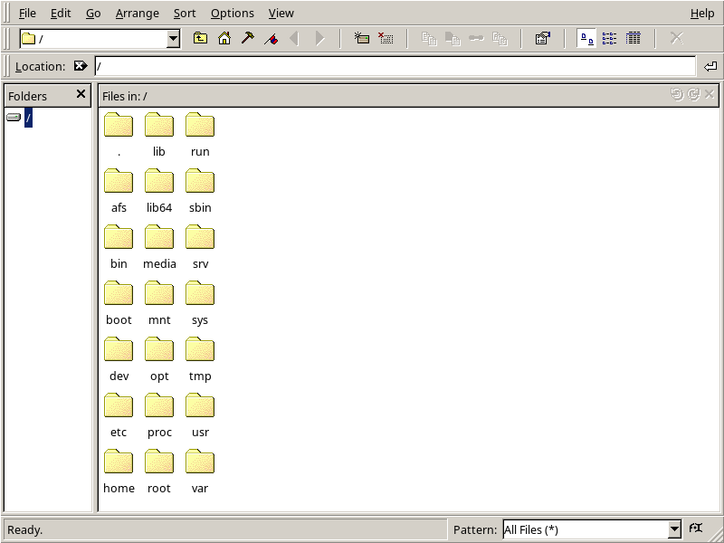
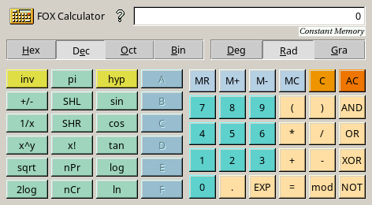
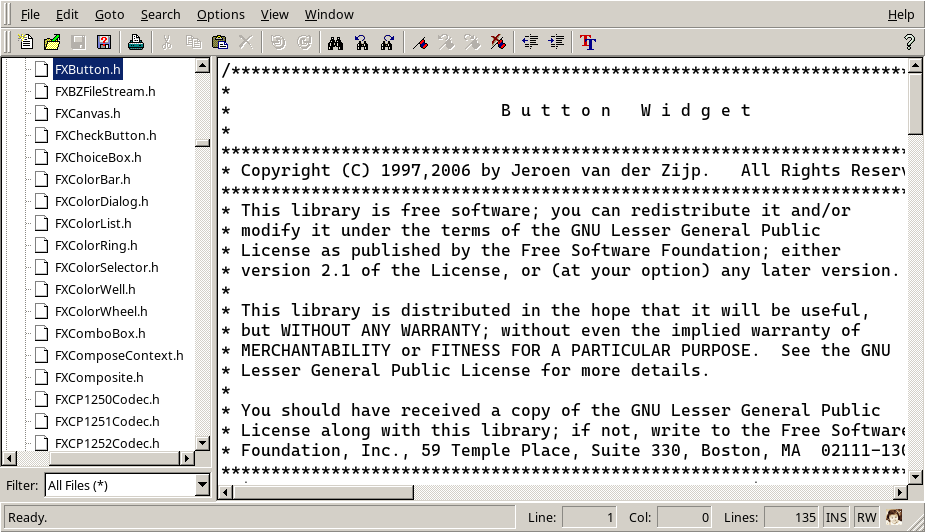

# FoxTK-rs

Rust bindings for the [fox-toolkit](http://www.fox-toolkit.org).

## What is [FOX](http://www.fox-toolkit.org)?

FOX is a C++ based Toolkit for developing Graphical User Interfaces easily and effectively. It offers a wide, and growing, collection of Controls, and provides state of the art facilities such as drag and drop, selection, as well as OpenGL widgets for 3D graphical manipulation. FOX also implements icons, images, and user-convenience features such as status line help, and tooltips. Tooltips may even be used for 3D objects!

Considerable importance has been placed on making FOX one of the fastest toolkits around, and to minimize memory use:- FOX uses a number of techniques to speed up drawing and spatial layout of the GUI. Memory is conserved by allowing programmers to create and destroy GUI elements on the fly.

## Dependencies

- [Linux](.github/workflows/make.sh)
- [Windows](.github/workflows/make.ps1)

## [Other](https://rubydoc.info/gems/fxruby/frames) bindings for [fox-toolkit](http://www.fox-toolkit.org)

## Software using [fox-toolkit](http://www.fox-toolkit.org)

- [Simulation of Urban MObility](https://github.com/eclipse-sumo/sumo)
- [X File Explorer](https://github.com/roland65/xfe)
- [ReZound](https://sourceforge.net/projects/rezound)
- [FOX Calculator](http://fox-toolkit.org/calc.html)
- [Adie](http://fox-toolkit.org/adie.html)

## Alternatives

- [FLTK-rs](https://github.com/fltk-rs)
- [GTK-rs](https://github.com/gtk-rs)
- [RSTK](https://codeberg.org/peterlane/rstk)
- [EFL-rs](https://codeberg.org/JustSoup321/efl-rs)

## [Human Interface Guidelines](https://www.fltk.org/hig.php)

## Work in process

- [x] [FXApp](docs/fx_app.md)
- [x] [Composite](docs/fx_composite.md)
  - [x] [FXGroupBox](docs/fx_composite.md#FXGroupBox) - Framed container with title
  - [x] [FXHorizontalFrame](docs/fx_composite.md#FXHorizontalFrame) - Basic horizontal packing
  - [x] [FXVerticalFrame](docs/fx_composite.md#FXVerticalFrame) - Basic vertical packing
  - [x] [FXSwitcher](docs/fx_composite.md#FXSwitcher)
- [x] Widgets
  - [x] [Outputs](docs/fx_outputs.md)
    - [x] [FXLabel](docs/fx_outputs.md#FXLabel) - Text and icon display
    - [x] [FXProgressBar](docs/fx_outputs.md#FXProgressBar)
  - [x] [Triggers](docs/fx_triggers.md)
    - [x] [FXButton](docs/fx_triggers.md#FXButton) - Standart push button
    - [x] [FXMenuBar](docs/fx_triggers.md#FXMenuBar) - Top menu bar
      - [x] [FXMenuPane](docs/fx_triggers.md#FXMenuPane) - Popup menus
        - [x] [FXMenuCommand](docs/fx_triggers.md#FXMenuCommand) - Menu items
  - [x] [Inputs](docs/fx_inputs.md)
    - [x] String
      - [x] [FXText](docs/fx_inputs.md#FXText) - Multi-line text editor
      - [x] [FXTextField](docs/fx_inputs.md#FXTextField) - Single-line text input
    - [x] [Rangers](docs/fx_rangers.md)
      - [x] Numeric
        - [x] [FXSpinner](docs/fx_rangers.md#FXSpinner) - Numeric input with arrows
        - [x] [FXSlider](docs/fx_rangers.md#FXSlider) - Value slider
  - [x] [Selectors](docs/fx_selectors.md)
    - [x] [FXList](docs/fx_selectors.md#FXList) - Simple item list
    - [x] [FXListBox](docs/fx_selectors.md#FXListBox) - Choise

# [Scrot](https://github.com/resurrecting-open-source-projects/scrot)

- 
- 
- 
